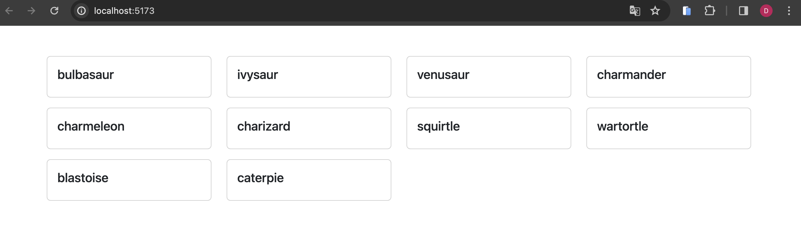

## Langkah - langkah pengerjaan

### Install Project

```
npm install
```

### Menjalankan aplikasi

```
npm run dev
```

## Ekspektasi

Tampilkan list card menggunakan component yang sudah disediaskan. Card berisi nama-nama pokemon yang di dapatkan dari API seperti contoh dibawah :



## API YANG DIGUNAKAN

https://pokeapi.co/api/v2/pokemon?limit=10

kamu bisa mengambil data dari API menggunakan axios, fetch atau cara lainnya sesuai yang kamu sukai.
